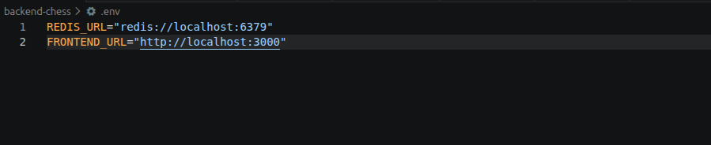

 # Multiplayer Chess Backend

 ## How to run this Backend Locally 

1.) First create a .env file in the root folder and fill it with `REDIS_URL` and `FRONTEND_URL` (*Check [frontend Repo](https://github.com/PrabeshBimali/multiplayer-chess) for setting up frontend locally*) fields as shown in figure below. You can setup `PORT` in this file if you want program to run in different port.

2.) While in root folder in terminal run `npm install` command and wait for it to install all packages.

3.) After all packages are installed run `npm run dev` and your server should be up and running locally at `localhost:8000`.

For Live Demo check the URL below  
(*Note: This backend as well as Redis is run in free server so sometime it will not work or take long time to work*)

Live Preview: (https://multiplayer-chess-five.vercel.app/)

Frontend URL: (https://github.com/PrabeshBimali/multiplayer-chess)
